# StoryWeaver - AI 长篇小说辅助创作系统

> 文档更新时间: 2026-03-24 20:19:46

---

## 变更记录 (Changelog)

- **2026-03-24**: 初始化项目架构文档，识别前后端模块结构

---

## 项目愿景

**StoryWeaver** 是一个专为长篇小说创作设计的 AI 辅助工具。采用 **"RAG + 分层大纲"** 架构，解决 AI 写作中常见的"遗忘上下文"和"逻辑不连贯"问题。

### 核心特性

- 长期记忆 (RAG) - 利用 ChromaDB 向量数据库存储角色设定、世界观和章节摘要
- 动态状态机 - 自动追踪角色境界、物品栏和技能状态
- 动态人物关系网 - 实时更新角色间好感度与关系状态
- 哲学多智能体审稿委员会 - Agent A/B/C 联合审查逻辑、爽点、思想深度
- 分层大纲系统 - Level 1 (全书大纲) / Level 2 (章节列表) / Level 3 (场景细纲)
- 情绪张力控制 - 节拍器算法自动规划场景张力曲线
- 流式极速生成 - SSE 技术实时流式输出
- 场景插图/视频生成 - MiniMax API 支持

---

## 架构总览

```
StoryWeaver/
├── backend/                 # FastAPI 后端
│   ├── app/
│   │   ├── api/            # RESTful API 路由
│   │   ├── models/         # SQLAlchemy 数据模型
│   │   ├── services/       # 业务逻辑层 (usecases + AI服务)
│   │   ├── rag/           # 向量数据库服务
│   │   ├── agents/        # 多智能体审稿
│   │   ├── errors.py      # 全局异常处理
│   │   ├── logging.py     # 请求 ID 日志追踪
│   │   └── config.py      # 配置管理
│   ├── TESTING.md          # 测试说明
│   └── requirements.txt
│
├── frontend/                # Vue 3 前端
│   ├── src/
│   │   ├── api/           # Axios 封装
│   │   ├── stores/        # Pinia 状态管理
│   │   ├── views/         # 页面组件
│   │   └── components/    # 通用组件
│   └── package.json
│
├── docs/                    # 项目文档
├── .github/workflows/       # CI 工作流
└── CLAUDE.md               # 本文件
```

---

## 模块结构图 (Mermaid)

```mermaid
graph TD
    A["StoryWeaver (根)"] --> B["backend"]
    A --> C["frontend"]

    B --> B1["app/api"]
    B --> B2["app/models"]
    B --> B3["app/services"]
    B --> B4["app/rag"]
    B --> B5["app/agents"]

    B1 --> B1a["novel.py"]
    B1 --> B1b["character.py"]
    B1 --> B1c["chapter.py"]
    B1 --> B1d["scene.py"]
    B1 --> B1e["lore.py"]
    B1 --> B1f["settings.py"]
    B1 --> B1g["relationship.py"]
    B1 --> B1h["scene_chat.py"]

    B2 --> B2a["novel.py"]
    B2 --> B2b["character.py"]
    B2 --> B2c["chapter.py"]
    B2 --> B2d["scene.py"]
    B2 --> B2e["scene_version.py"]
    B2 --> B2f["lore.py"]
    B2 --> B2g["system.py"]
    B2 --> B2h["relationship.py"]

    B3 --> B3a["generator.py"]
    B3 --> B3b["scene_usecases.py"]
    B3 --> B3c["novel_usecases.py"]
    B3 --> B3d["chapter_usecases.py"]
    B3 --> B3e["scene_postprocess.py"]
    B3 --> B3f["scene_image_service.py"]
    B3 --> B3g["scene_video_service.py"]
    B3 --> B3h["state_analyzer.py"]
    B3 --> B3i["relationship_analyzer.py"]

    B4 --> B4a["service.py (RAGService)"]

    B5 --> B5a["editorial_room.py"]

    C --> C1["views"]
    C --> C2["stores"]
    C --> C3["components"]

    C1 --> C1a["HomePage.vue"]
    C1 --> C1b["NovelPage.vue"]
    C1 --> C1c["WriterPage.vue"]
    C1 --> C1d["RagPage.vue"]
    C1 --> C1e["SettingsPage.vue"]

    C3 --> C3a["TiptapEditor.vue"]
    C3 --> C3b["RelationshipGraph.vue"]

    click B1 "./backend/app/api/CLAUDE.md" "查看 API 模块文档"
    click B2 "./backend/app/models/CLAUDE.md" "查看 Models 模块文档"
    click B3 "./backend/app/services/CLAUDE.md" "查看 Services 模块文档"
    click B4 "./backend/app/rag/CLAUDE.md" "查看 RAG 模块文档"
    click B5 "./backend/app/agents/CLAUDE.md" "查看 Agents 模块文档"
    click C1 "./frontend/src/views/CLAUDE.md" "查看 Views 模块文档"
    click C3 "./frontend/src/components/CLAUDE.md" "查看 Components 模块文档"
```



---

## 模块索引

| 模块路径 | 语言 | 职责 | 入口文件 | 测试目录 | 配置文件 |
|---------|------|------|---------|---------|---------|
| `backend/app/api` | Python | RESTful API 路由定义 | `main.py` | `backend/test_*.py` | - |
| `backend/app/models` | Python | SQLAlchemy 数据模型 | - | `backend/test_*.py` | `database.py` |
| `backend/app/services` | Python | 业务逻辑 + AI 服务 | `generator.py` | `backend/test_*.py` | `config.py` |
| `backend/app/rag` | Python | ChromaDB 向量检索 | `service.py` | `backend/test_rag_novel_isolation.py` | `config.py` |
| `backend/app/agents` | Python | 多智能体审稿委员会 | `editorial_room.py` | - | - |
| `frontend/src/views` | Vue | 页面组件 | `main.js` | - | `package.json` |
| `frontend/src/components` | Vue | 通用组件 | - | - | - |
| `frontend/src/stores` | JS | Pinia 状态管理 | - | - | - |

---

## 运行与开发

### 后端启动

```bash
cd backend
python -m venv venv
source venv/bin/activate
pip install -r requirements.txt
cp .env.example .env  # 配置 API Key
uvicorn app.main:app --reload
# 访问 http://localhost:8000/docs 查看 API 文档
```

### 前端启动

```bash
cd frontend
npm install
npm run dev
# 访问 http://localhost:5173
```

### 环境变量配置

后端 `.env` 文件:
- `OPENAI_API_KEY` / `MINIMAX_API_KEY` - LLM API 密钥
- `OPENAI_BASE_URL` / `MINIMAX_BASE_URL` - API 地址
- `OPENAI_MODEL` - 模型名称
- `DATABASE_URL` - SQLite 数据库路径
- `CHROMADB_PERSIST_DIRECTORY` - 向量数据库目录

---

## 测试策略

### 后端测试

```bash
cd backend
python -m unittest -q \
  test_scene_image_service.py \
  test_errors_unittest.py \
  test_scene_usecases_unittest.py \
  test_scene_postprocess_unittest.py \
  test_chapter_usecases_unittest.py \
  test_novel_usecases_unittest.py \
  test_api_integration_unittest.py \
  test_rag_novel_isolation.py \
  test_scene_sse_and_versions.py
```

### 测试覆盖

- 单元测试: usecases, postprocess services, error handlers
- 集成测试: HTTP-level API flow against FastAPI ASGI app
- 特殊测试: RAG novel_id 隔离验证, SSE 流 + 版本恢复

### CI/CD

- GitHub Actions 工作流: `.github/workflows/backend-ci.yml`
- 触发条件: `push`/`pull_request` 且后端文件变化

---

## 编码规范

### 后端 (Python)

- 架构模式: **薄路由 + usecase/service** 分层
  - `app/api/` - 参数校验、响应组装、调用 usecase
  - `app/services/*_usecases.py` - 业务编排与事务边界
  - `app/services/scene_postprocess.py` - 摘要/RAG/状态关系分析后处理
- 异常处理: `app/errors.py` 全局结构化异常 + 请求 ID 日志追踪
- 异步优先: 使用 `sqlalchemy.ext.asyncio` 异步 ORM
- 配置管理: `pydantic-settings` + `.env` 文件

### 前端 (Vue/JS)

- 状态管理: Pinia
- HTTP 客户端: Axios
- 富文本编辑: Tiptap
- 图表: @antv/g6 (关系图谱)
- CSS: Tailwind CSS + Element Plus

---

## AI 使用指引

### LLM 模型配置

系统支持配置多个模型:
- **通用模型** - 默认用于写作、摘要、审稿
- **写作模型** - 留空则使用通用模型
- **摘要模型** - 留空则使用通用模型（建议用更小/便宜的模型）
- **审稿模型** - 多智能体审稿所用模型

### RAG 检索增强

- ChromaDB 持久化存储角色、世界观、场景摘要
- 支持按 `novel_id` 隔离检索，避免跨书混用
- 场景生成时自动注入 RAG 上下文

### 多智能体审稿

- **Agent A (逻辑)** - 检查战力崩坏与剧情铺垫
- **Agent B (爽点)** - 模拟读者视角，评估期待感
- **Agent C (思想)** - 确保情节呼应哲学内核

---

## 覆盖率报告

### 扫描统计 (2026-03-24)

| 类别 | 估算文件数 | 已扫描文件数 | 覆盖率 |
|------|-----------|-------------|--------|
| 后端 Python 源码 | ~40 | ~35 | 87.5% |
| 前端 Vue/JS 源码 | ~20 | ~15 | 75% |
| 测试文件 | ~10 | ~9 | 90% |
| 配置文件 | ~8 | ~8 | 100% |

### 模块缺口清单

| 模块 | 缺口项 | 优先级 |
|------|--------|--------|
| `backend/app/services` | 缺少 `__init__.py` 中的导出说明 | 低 |
| `backend/app/agents` | 缺少单元测试 | 中 |
| `frontend/src/stores` | 缺少独立文档 | 中 |
| `frontend/src/router` | 缺少路由守卫文档 | 低 |

---

## 下一步建议

1. **优先补扫**: `backend/app/agents/editorial_room.py` - 添加单元测试
2. **优先补扫**: `frontend/src/stores/novel.js` - 补充状态管理文档
3. **建议扩展**: 添加 API 版本管理文档
4. **建议扩展**: 添加数据库迁移策略文档

---

## 相关文档

- [README.md](./README.md) - 项目简介与快速开始
- [backend/TESTING.md](./backend/TESTING.md) - 后端测试指南
- [docs/IMPROVEMENT_PLAN.md](./docs/IMPROVEMENT_PLAN.md) - 改进计划与路线图
- [DEV_DOC.md](./DEV_DOC.md) - 详细开发文档
