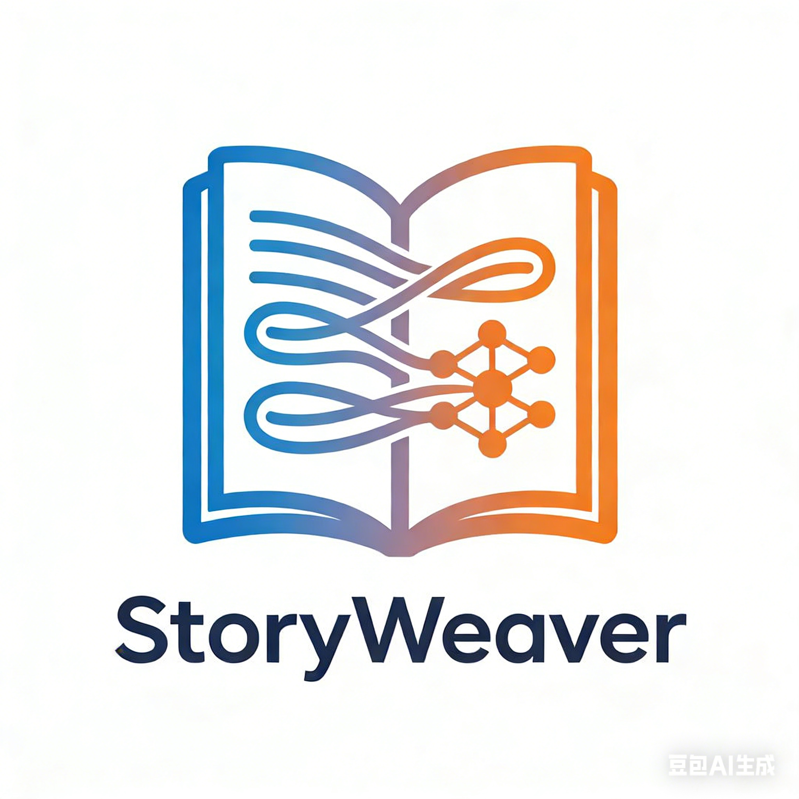
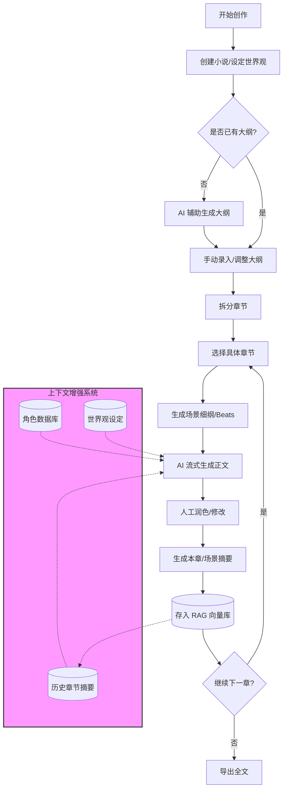

<div align="center">
  
  <h1>StoryWeaver</h1>
  <p><strong>AI 驱动的长篇小说辅助创作系统</strong></p>
  <p>RAG (检索增强生成) · 分层大纲 · 自动摘要 · 流式写作</p>

  [](LICENSE)
  [](https://vuejs.org/)
  [](https://fastapi.tiangolo.com/)
  [](https://www.python.org/)
</div>

---

## 📖 项目简介

**StoryWeaver** 是一个专为长篇小说创作设计的 AI 辅助工具。不同于普通的 AI 聊天机器人，它采用 **"RAG + 分层大纲"** 的架构，解决了 AI 写作中常见的“遗忘上下文”和“逻辑不连贯”问题。

通过结构化的工程方法，StoryWeaver 帮助作者从世界观设定开始，一步步构建大纲、拆分场景，最终生成高质量的小说正文。

## ✨ 核心特性

- **🧠 长期记忆 (RAG)**：利用向量数据库 (ChromaDB) 存储角色设定、世界观和已写章节摘要，AI 永远不会忘记主角的瞳色或上一章的伏笔。
- **📑 分层大纲系统**：
  - **Level 1**: 全书大纲与故事核
  - **Level 2**: 章节列表
  - **Level 3**: 场景细纲 (Scene Beats) —— 精确控制 AI 的写作方向。
- **⚡️ 流式极速生成**：基于 SSE (Server-Sent Events) 技术，实时流式输出，写作体验如丝般顺滑。
- **🔄 自动摘要闭环**：每写完一个场景，系统自动提炼摘要并存入记忆库，为后续章节提供精准的上下文。
- **📝 专业写作界面**：集成 Tiptap 富文本编辑器，支持 Markdown，提供沉浸式的写作环境。

## 🔄 创作流程



## 🛠 技术栈

### Frontend (前端)

| 技术 | 说明 |
| :--- | :--- |
|  | **Vue 3** - 渐进式 JavaScript 框架 |
|  | **Vite** - 极速前端构建工具 |
|  | **Pinia** - 直观的状态管理库 |
|  | **Element Plus** - 基于 Vue 3 的组件库 |
|  | **Tiptap** - 无头富文本编辑器 |

### Backend (后端)

| 技术 | 说明 |
| :--- | :--- |
|  | **FastAPI** - 高性能 Python Web 框架 |
|  | **SQLAlchemy (Async)** - 异步 ORM |
|  | **ChromaDB** - 开源嵌入向量数据库 |
|  | **LangChain** - LLM 应用开发框架 |
|  | **SQLite** - 轻量级关系型数据库 |

## 🚀 快速开始

### 1. 克隆项目

```bash
git clone https://github.com/linnyh/StoryWeaver.git
cd StoryWeaver
```

### 2. 后端设置

```bash
cd backend

# 创建虚拟环境 (推荐)
python -m venv venv
source venv/bin/activate  # Windows: venv\Scripts\activate

# 安装依赖
pip install -r requirements.txt

# 配置环境变量
cp .env.example .env
# 编辑 .env 文件，填入你的 OpenAI 或 MiniMax API Key
```

### 3. 前端设置

```bash
cd frontend

# 安装依赖
npm install

# 启动开发服务器
npm run dev
```

### 4. 启动服务

- **后端**: `http://localhost:8000` (API 文档: `/docs`)
- **前端**: `http://localhost:5173`

```bash
# 在 backend 目录下
uvicorn app.main:app --reload
```

## 📂 项目结构

```
StoryWeaver/
├── 📂 backend/                 # FastAPI 后端核心
│   ├── 📂 app/
│   │   ├── 📂 api/            # RESTful API 路由定义
│   │   ├── 📂 models/         # SQLAlchemy 数据库模型
│   │   ├── 📂 services/       # 核心业务逻辑 (LLM调用/大纲生成/摘要)
│   │   └── 📂 rag/            # 向量数据库检索服务
│   ├── 📄 requirements.txt    # Python 依赖
│   └── 📄 main.py             # 入口文件
│
├── 📂 frontend/                # Vue 3 前端应用
│   ├── 📂 src/
│   │   ├── 📂 views/          # 页面组件 (小说页/写作页/RAG管理)
│   │   ├── 📂 components/     # 通用 UI 组件
│   │   ├── 📂 stores/         # Pinia 状态仓库
│   │   └── 📂 api/            # Axios 请求封装
│   └── 📄 package.json        # Node 依赖
│
└── 📄 DEV_DOC.md               # 详细开发文档
```

## 🤝 贡献指南

欢迎提交 Issue 和 Pull Request！

1. Fork 本仓库
2. 创建特性分支 (`git checkout -b feature/AmazingFeature`)
3. 提交更改 (`git commit -m 'Add some AmazingFeature'`)
4. 推送到分支 (`git push origin feature/AmazingFeature`)
5. 提交 Pull Request

## 📄 许可证

本项目采用 [MIT 许可证](LICENSE)。

---

<div align="center">
  <p>Made with ❤️ by StoryWeaver Team</p>
</div>
