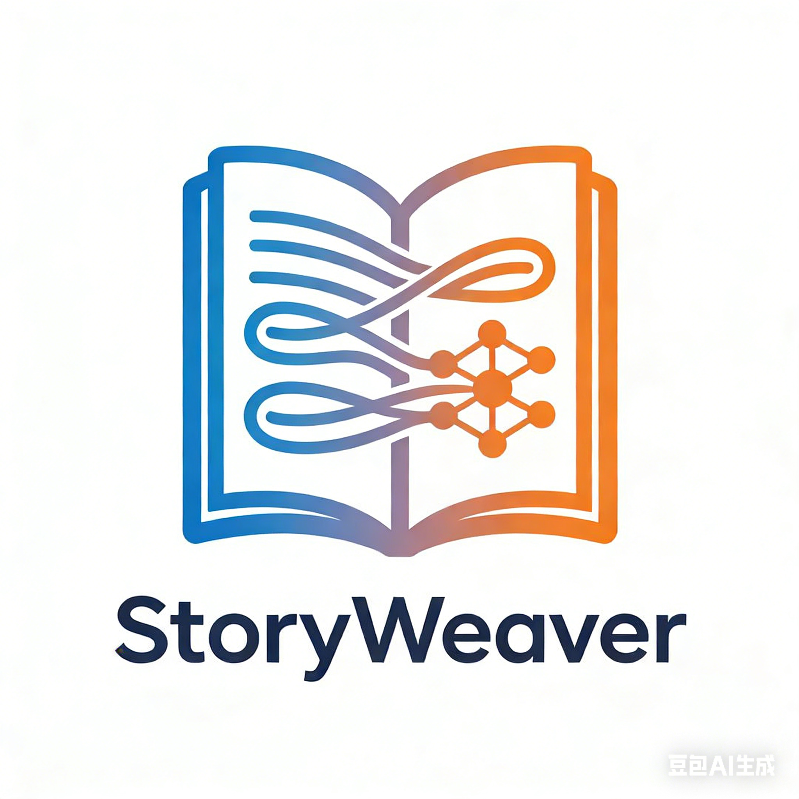
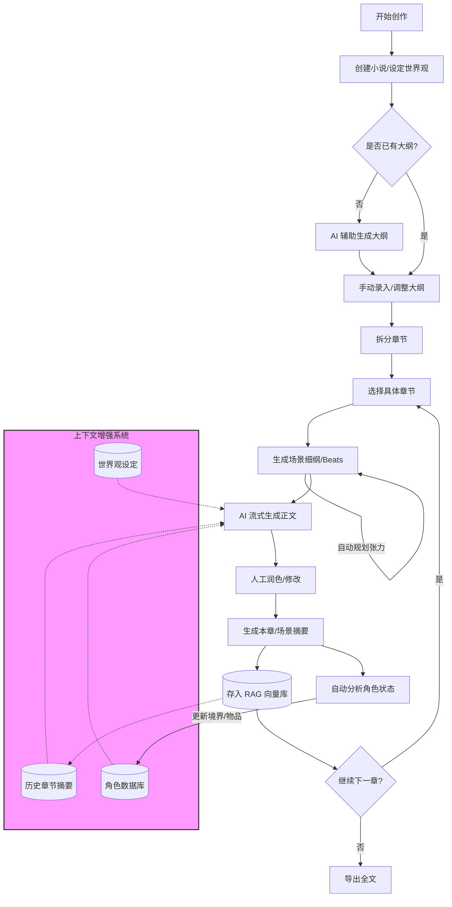

<div align="center">
  
  <h1>StoryWeaver</h1>
  <p><strong>AI 驱动的长篇小说辅助创作系统</strong></p>
  <p>RAG (检索增强生成) · 分层大纲 · 自动摘要 · 流式写作</p>

  [](LICENSE)
  [](https://vuejs.org/)
  [](https://fastapi.tiangolo.com/)
  [](https://www.python.org/)
</div>

---

## 📖 项目简介

**StoryWeaver** 是一个专为长篇小说创作设计的 AI 辅助工具。不同于普通的 AI 聊天机器人，它采用 **"RAG + 分层大纲"** 的架构，解决了 AI 写作中常见的“遗忘上下文”和“逻辑不连贯”问题。

通过结构化的工程方法，StoryWeaver 帮助作者从世界观设定开始，一步步构建大纲、拆分场景，最终生成高质量的小说正文。

## ✨ 核心特性

- **🧠 长期记忆 (RAG)**：利用向量数据库 (ChromaDB) 存储角色设定、世界观和已写章节摘要，AI 永远不会忘记主角的瞳色或上一章的伏笔。
- **📈 动态状态机 (Power System)**：
  - **角色状态追踪**：自动分析剧情，更新角色的境界、物品栏和技能状态（支持修仙、言情、悬疑等多类型）。
  - **爽点控制**：结合角色瓶颈与欲望，智能安排“打脸”或“突破”情节，确保爽点逻辑闭环。
- **🕸️ 动态人物关系网 (Dynamic Relationship Graph)**：
  - **关系演化追踪**：随着剧情发展，自动分析角色间的互动，实时更新好感度（亲密/敌对）与关系状态。
  - **可视化图谱**：提供直观的关系图谱 (Relationship Map)，清晰展示角色间的羁绊、核心矛盾与阵营分布。
- **🧠 哲学多智能体审稿委员会 (Philosophical Multi-Agent Editorial Room)**：
  - **多视角审查**：引入三个独立 Agent 对初稿进行全方位体检：
    - **Agent A (逻辑)**：检查战力崩坏与剧情铺垫。
    - **Agent B (爽点)**：模拟读者视角，评估期待感与情绪释放。
    - **Agent C (思想)**：确保情节呼应小说的“哲学思想内核”，提升立意深度。
  - **自动修订循环**：若评分低于标准，系统自动收集修改意见并打回重写，直至达标或达到重试上限。
  - **透明化日志**：提供完整的审稿日志与修改建议，让作者了解 AI 的思考过程。
- **📑 分层大纲系统**：
  - **Level 1**: 全书大纲与故事核
  - **Level 2**: 章节列表
  - **Level 3**: 场景细纲 (Scene Beats) —— 精确控制 AI 的写作方向。
- **🎭 情绪张力控制 (Tension Control)**：
  - **节拍器算法**：自动规划场景的张力曲线（起承转合），告别流水账。
  - **情绪目标导向**：为每个场景设定“压抑”、“释放”、“悬疑”等情绪目标，指导 AI 的行文风格。
- **⚡️ 流式极速生成**：基于 SSE (Server-Sent Events) 技术，实时流式输出，写作体验如丝般顺滑。
- **🔄 自动摘要闭环**：每写完一个场景，系统自动提炼摘要并存入记忆库，为后续章节提供精准的上下文。
- **🔍 插图生成**：AI 会根据场景内容生成相关的场景插图，丰富阅读体验。
- **📝 专业写作界面**：集成 Tiptap 富文本编辑器，支持 Markdown，提供沉浸式的写作环境。

## 🔄 创作流程


```mermaid
flowchart TD
    A[开始创作] --> B[创建小说/设定世界观]
    B --> C{是否已有大纲?}
    C -- 否 --> D[AI 辅助生成大纲]
    C -- 是 --> E[手动录入/调整大纲]
    D --> E
    E --> F[拆分章节]
    F --> G[选择具体章节]
    G --> H[生成场景细纲/Beats]
    H -- 自动规划张力 --> H
    H --> I[AI 流式生成正文]
    I --> J[人工润色/修改]
    J --> K[生成本章/场景摘要]
    K --> L[(存入 RAG 向量库)]
    K --> S[自动分析角色状态]
    S -- 更新境界/物品 --> O
    L --> M{继续下一章?}
    M -- 是 --> G
    M -- 否 --> N[导出全文]
    
    subgraph Context [上下文增强系统]
        O[(角色数据库)]
        P[(世界观设定)]
        Q[(历史章节摘要)]
    end
    
    O -.-> I
    P -.-> I
    Q -.-> I
    L -.-> Q
    
    style Context fill:#f9f,stroke:#333,stroke-width:2px
```

## 🛠 技术栈

### Frontend (前端)

| 技术 | 说明 |
| :--- | :--- |
|  | **Vue 3** - 渐进式 JavaScript 框架 |
|  | **Vite** - 极速前端构建工具 |
|  | **Pinia** - 直观的状态管理库 |
|  | **Element Plus** - 基于 Vue 3 的组件库 |
|  | **Tiptap** - 无头富文本编辑器 |

### Backend (后端)

| 技术 | 说明 |
| :--- | :--- |
|  | **FastAPI** - 高性能 Python Web 框架 |
|  | **SQLAlchemy (Async)** - 异步 ORM |
|  | **ChromaDB** - 开源嵌入向量数据库 |
|  | **LangChain** - LLM 应用开发框架 |
|  | **SQLite** - 轻量级关系型数据库 |

## 🚀 快速开始

### 1. 克隆项目

```bash
git clone https://github.com/linnyh/StoryWeaver.git
cd StoryWeaver
```

### 2. 后端设置

```bash
cd backend

# 创建虚拟环境 (推荐)
python -m venv venv
source venv/bin/activate  # Windows: venv\Scripts\activate

# 安装依赖
pip install -r requirements.txt

# 配置环境变量
cp .env.example .env
# 编辑 .env 文件，填入你的 OpenAI 或 MiniMax API Key
```

### 3. 前端设置

```bash
cd frontend

# 安装依赖
npm install

# 启动开发服务器
npm run dev
```

### 4. 启动服务

- **后端**: `http://localhost:8000` (API 文档: `/docs`)
- **前端**: `http://localhost:5173`

```bash
# 在 backend 目录下
uvicorn app.main:app --reload
```

## ✅ 测试与 CI

后端测试说明见：`backend/TESTING.md`

在 `backend/` 目录执行：

```bash
python -m unittest -q \
  test_scene_image_service.py \
  test_errors_unittest.py \
  test_scene_usecases_unittest.py \
  test_scene_postprocess_unittest.py \
  test_chapter_usecases_unittest.py \
  test_novel_usecases_unittest.py \
  test_api_integration_unittest.py
```

CI 工作流：

- `.github/workflows/backend-ci.yml`
- 在 `push/pull_request` 且后端相关文件变化时自动运行上述测试。

## 🧱 后端架构现状（重构后）

后端已采用“薄路由 + usecase/service”分层：

- `app/api/`：参数校验、响应组装、调用 usecase。
- `app/services/*_usecases.py`：业务编排与事务边界。
- `app/services/scene_postprocess.py`：场景摘要/RAG/状态关系分析后处理。
- `app/errors.py` + `app/logging.py`：全局异常结构与请求 ID 日志追踪。

## 📂 项目结构

```
StoryWeaver/
├── 📂 backend/                 # FastAPI 后端核心
│   ├── 📂 app/
│   │   ├── 📂 api/            # RESTful API 路由定义
│   │   ├── 📂 models/         # SQLAlchemy 数据库模型
│   │   ├── 📂 services/       # usecase/service 业务逻辑层
│   │   └── 📂 rag/            # 向量数据库检索服务
│   ├── 📄 TESTING.md          # 后端测试与CI说明
│   ├── 📄 requirements.txt    # Python 依赖
│   └── 📄 main.py             # 入口文件
│
├── 📂 frontend/                # Vue 3 前端应用
│   ├── 📂 src/
│   │   ├── 📂 views/          # 页面组件 (小说页/写作页/RAG管理)
│   │   ├── 📂 components/     # 通用 UI 组件
│   │   ├── 📂 stores/         # Pinia 状态仓库
│   │   └── 📂 api/            # Axios 请求封装
│   └── 📄 package.json        # Node 依赖
│
├── 📂 .github/workflows/       # CI 工作流
└── 📄 DEV_DOC.md               # 详细开发文档
```

## 🤝 贡献指南

欢迎提交 Issue 和 Pull Request！

1. Fork 本仓库
2. 创建特性分支 (`git checkout -b feature/AmazingFeature`)
3. 提交更改 (`git commit -m 'Add some AmazingFeature'`)
4. 推送到分支 (`git push origin feature/AmazingFeature`)
5. 提交 Pull Request

## 📄 许可证

本项目采用 [MIT 许可证](LICENSE)。

---

<div align="center">
  <p>Made with ❤️ by StoryWeaver Team</p>
</div>
