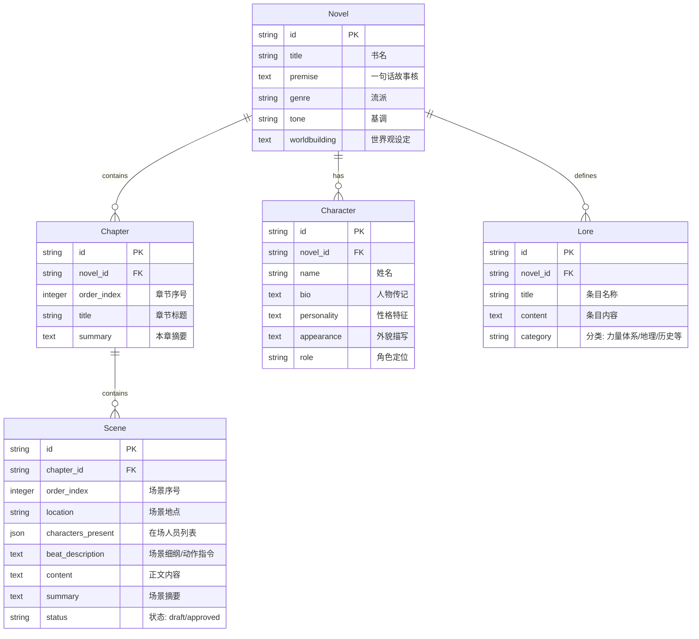

# 数据库表结构说明 (Database Schema)

StoryWeaver 使用 SQLAlchemy 作为 ORM 框架，默认支持 SQLite（开发环境）和 PostgreSQL（生产环境）。

## 实体关系图 (ER Diagram)

## 详细表结构

### 1. Novels (小说表)

存储小说的核心元数据。

| 字段名 | 类型 | 必填 | 说明 |
| :--- | :--- | :--- | :--- |
| `id` | String(36) | Yes | 主键 (UUID) |
| `title` | String(255) | Yes | 小说标题 |
| `premise` | Text | No | 故事核心梗概 (Logline) |
| `genre` | String(50) | No | 流派 (如：玄幻、科幻) |
| `tone` | String(50) | No | 叙事基调 (如：幽默、黑暗) |
| `worldbuilding` | Text | No | 整体世界观背景设定 |

### 2. Chapters (章节表)

存储章节结构，作为场景的容器。

| 字段名 | 类型 | 必填 | 说明 |
| :--- | :--- | :--- | :--- |
| `id` | String(36) | Yes | 主键 (UUID) |
| `novel_id` | String(36) | Yes | 外键 -> Novels.id |
| `order_index` | Integer | Yes | 章节排序索引 |
| `title` | String(255) | No | 章节标题 |
| `summary` | Text | No | 整章摘要 (用于上下文生成) |

### 3. Scenes (场景/细纲表)

写作的最小单元，包含细纲（Beats）和生成的正文。

| 字段名 | 类型 | 必填 | 说明 |
| :--- | :--- | :--- | :--- |
| `id` | String(36) | Yes | 主键 (UUID) |
| `chapter_id` | String(36) | Yes | 外键 -> Chapters.id |
| `order_index` | Integer | Yes | 场景排序索引 |
| `location` | String(255) | No | 发生地点 |
| `characters_present` | JSON | No | 当前场景在场角色列表 |
| `beat_description` | Text | No | 场景细纲 (指导 AI 写作的指令) |
| `content` | Text | No | AI 生成的小说正文 |
| `summary` | Text | No | 场景级摘要 (存入向量库) |
| `status` | String(20) | Yes | 状态 (draft, approved) |

### 4. Characters (角色表)

存储角色档案，用于 RAG 检索。

| 字段名 | 类型 | 必填 | 说明 |
| :--- | :--- | :--- | :--- |
| `id` | String(36) | Yes | 主键 (UUID) |
| `novel_id` | String(36) | Yes | 外键 -> Novels.id |
| `name` | String(100) | Yes | 角色姓名 |
| `bio` | Text | No | 生平传记 |
| `personality` | Text | No | 性格特征 |
| `appearance` | Text | No | 外貌特征 |
| `role` | String(50) | No | 角色定位 (主角/配角/反派) |

### 5. Lores (世界观设定表)

存储百科式的世界观条目，用于 RAG 检索。

| 字段名 | 类型 | 必填 | 说明 |
| :--- | :--- | :--- | :--- |
| `id` | String(36) | Yes | 主键 (UUID) |
| `novel_id` | String(36) | Yes | 外键 -> Novels.id |
| `title` | String(200) | Yes | 条目标题 |
| `content` | Text | No | 详细设定内容 |
| `category` | String(50) | No | 分类 (Magic System, Geography, History...) |
